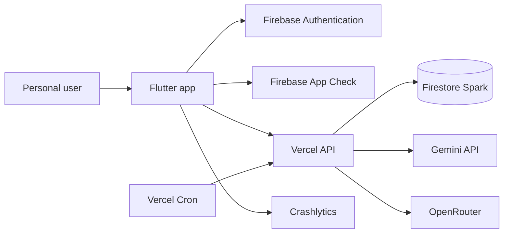
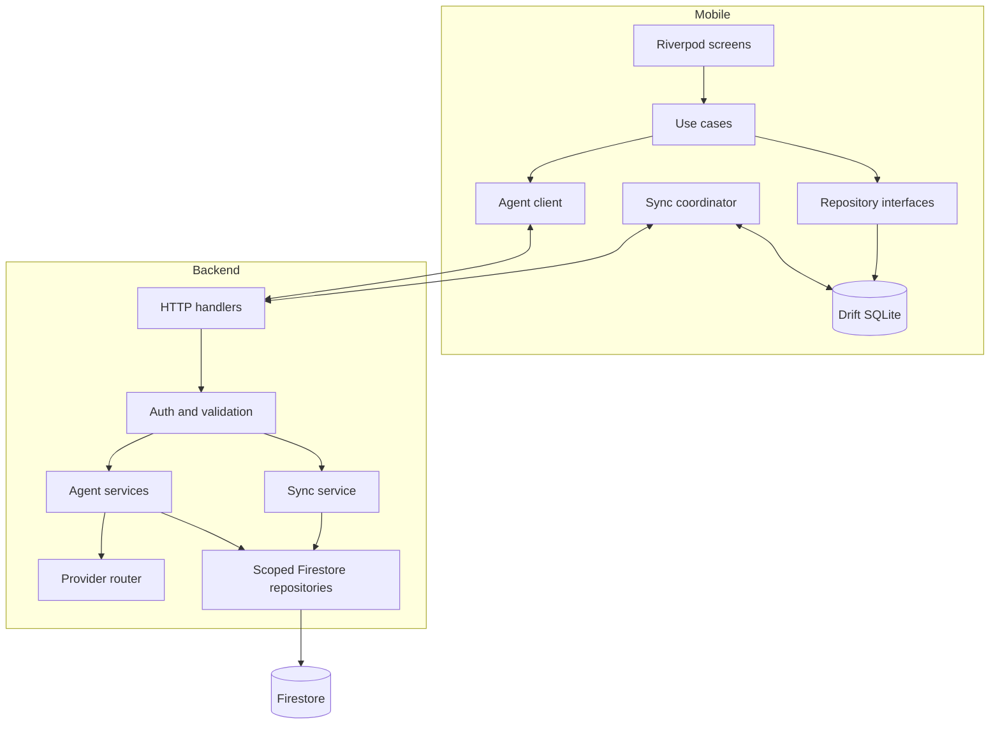
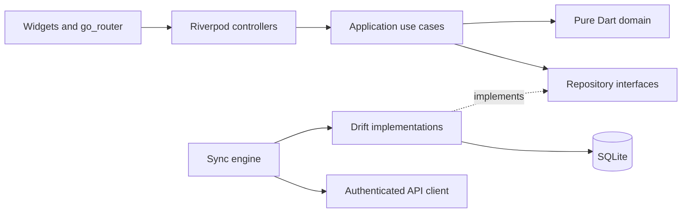
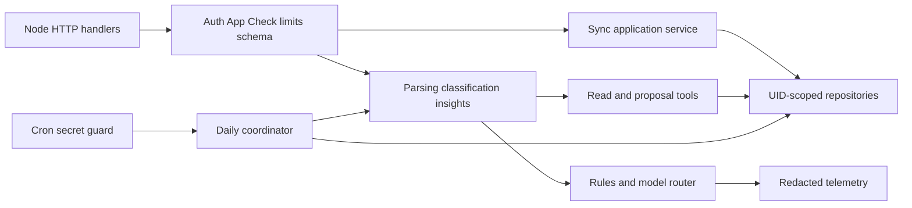
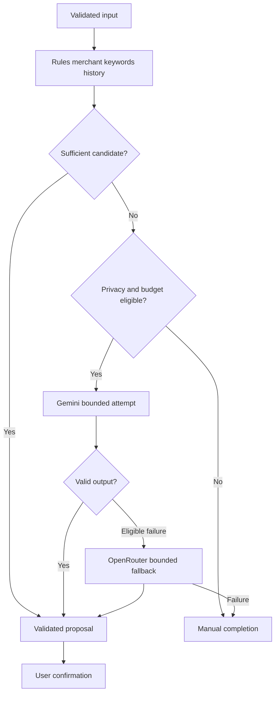
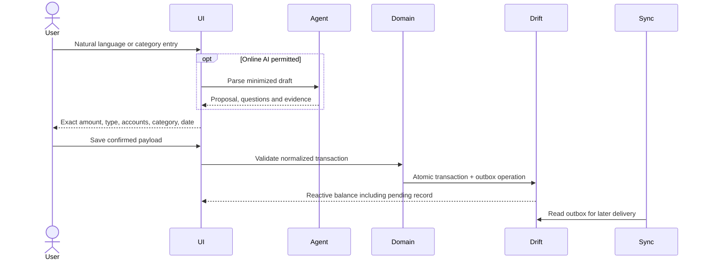
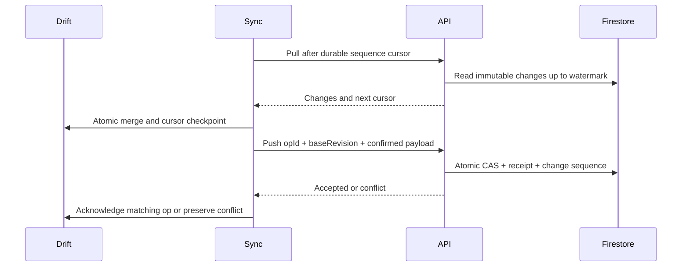
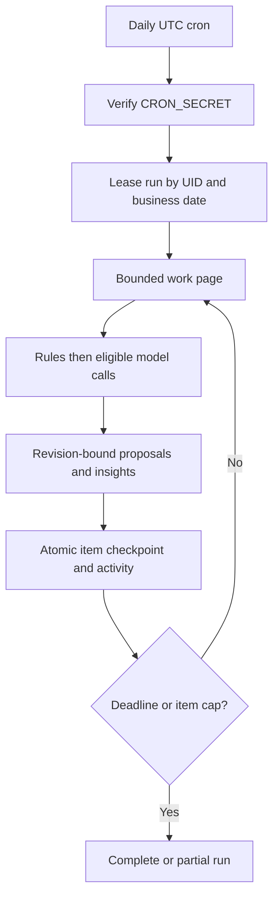
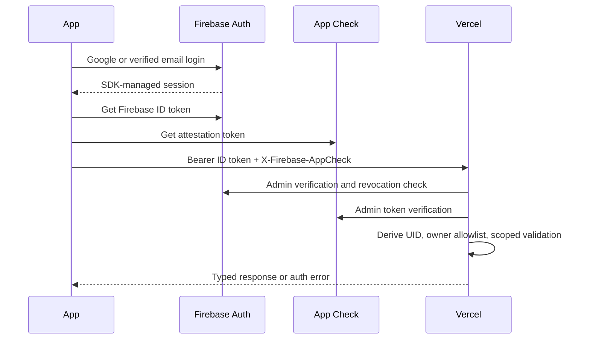

# System architecture

## Responsibilities

One Flutter application and one modular TypeScript backend; no microservices or queue service. Drift stores the local confirmed ledger plus pending overlays. Firestore stores the accepted remote replica and server outputs. Vercel is the authenticated synchronization gateway and agent host. Firebase Auth owns identity; App Check attests app requests; Crashlytics receives redacted diagnostics. Gemini/OpenRouter see only minimized inference context and cannot reach the database.

The required path is Flutter UI → Repository → Drift → Sync Engine → Firestore, with **Vercel inserted between Sync Engine and Firestore** to enforce revision checks, authorization, references and idempotency atomically. Direct Flutter Firestore access is disabled; no second persistence queue exists. This is a deliberate refinement of the legacy design, recorded in ADR-07.

## System context

## Containers and components

## Flutter architecture

Feature folders contain presentation/application/domain/data where needed. Domain has no Flutter, Firebase, SQL or HTTP imports. Riverpod wires implementations and streams; routers handle session/onboarding guards. Controllers never calculate balances independently.

## Backend architecture

Use native Vercel Node functions under backend/api; no Next.js UI/framework requirement. Initialize Firebase Admin once per warm instance. Never invoke providers inside Firestore transaction callbacks, which may rerun.

## AI provider flow

## Transaction creation

## Offline sync

## Daily execution

## Authentication

These diagrams are logical boundaries, not evidence of deployed infrastructure. Protocol detail belongs to [sync](08-OFFLINE-SYNC.md), [API](05-API-CONTRACTS.md) and [AI](06-AI-AGENT-DESIGN.md).
