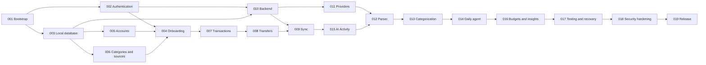

# Implementation plan

The repository currently contains specifications only. All implementation tasks start as `todo`; task numbers are identifiers, not a strict execution order. Follow the dependency graph below. Security, domain validation and tests belong in each phase; final hardening is not permission to postpone them.

## Execution order

A single implementer can use this order: **001, 002, 003, 005, 006, 004, 007, 008, 010, 009, 011, 015, 012, 013, 014, 016, 017, 018, 019**. Task 010 must implement the server sync contract before task 009 connects mobile replication. Task 015 establishes activity persistence/UI before parser and daily-agent work use it.

## Phase 1 — Foundation and identity

- **Objective:** reproducible mobile/backend shells, pinned tooling and authenticated session boundaries.
- **Prerequisites:** read AGENTS.md, technical/security specs; operator can obtain development Firebase configuration when real-device auth is needed.
- **Tasks:** [001](../tasks/001-project-bootstrap.md), [002](../tasks/002-authentication.md).
- **Deliverables/modules:** mobile app/router/theme/config, backend package/test shell, emulator configuration, auth repository, sign-in/verification screens, environment examples and CI skeleton.
- **Acceptance:** clean checkout setup is documented; Google/email flows work against appropriate dev services; unverified/signed-out sessions cannot access remote data; no secret is compiled into mobile.
- **Automated tests:** static analysis/typecheck, auth state/route guards, environment validation, initial widget smoke tests.
- **Manual tests:** launch Android dev build, sign in/out, verify email and reset password; inspect flavor/environment labeling.
- **Definition of done:** task acceptance evidence is recorded; reproducible versions/commands replace planned setup placeholders; no production deployment or model dependency is needed.

## Phase 2 — Local domain and onboarding

- **Objective:** establish durable typed data and correct domain vocabulary before transaction UI.
- **Prerequisites:** phase 1 shell; schema and integer-money decisions accepted.
- **Tasks:** [003](../tasks/003-local-database.md), [005](../tasks/005-accounts.md), [006](../tasks/006-categories-income-sources.md), then [004](../tasks/004-onboarding.md).
- **Deliverables/modules:** domain values, Drift DAOs/migrations, outbox/shadows, account/opening use case, categories/sources, onboarding and settings/profile repositories.
- **Acceptance:** opening entries are atomic with accounts, defaults are accepted once, one currency is enforced, UID databases are isolated, onboarding resumes without duplicates.
- **Automated tests:** decimal parsing, SQLite constraints/atomicity, migration/restart, reference hierarchy and onboarding resume tests.
- **Manual tests:** create bank/cash with positive/zero/negative openings; restart mid-onboarding; inspect concepts and large-text layout.
- **Definition of done:** local reference management works offline after auth; no mutable account balance field or direct SDK writes exist.

## Phase 3 — Deterministic ledger

- **Objective:** make manual recording complete and correct before enabling AI.
- **Prerequisites:** phase 2.
- **Tasks:** [007](../tasks/007-transactions.md), [008](../tasks/008-transfers.md).
- **Deliverables/modules:** normalized transaction validators, shared confirmation, category entry, history/dashboard queries, transfer editor and tombstones.
- **Acceptance:** income/expense/transfer/opening effects match the data model; edits/deletes replace/remove effects exactly once; offline Save survives restart.
- **Automated tests:** independent ledger property tests, shared serialization fixtures, repository atomicity, duplicate-submit widgets.
- **Manual tests:** salary → bank, bank → cash, cash → lunch; edit/delete and compare balances/reports by hand in airplane mode.
- **Definition of done:** all financial invariants pass and no network/model call is in the critical local-save path.

## Phase 4 — Authenticated replication

- **Objective:** synchronize safely across interruptions and devices.
- **Prerequisites:** phase 3 plus auth infrastructure.
- **Tasks:** [010](../tasks/010-vercel-backend.md) before [009](../tasks/009-offline-sync.md).
- **Deliverables/modules:** Node HTTP handlers, ID-token/App Check guards, scoped Admin repositories, sync contracts/receipts/change stream, mobile sync coordinator and conflict UI, deny-all client rules.
- **Acceptance:** replay never duplicates ledger effects; CAS preserves concurrent edits; no partial transfer/account-opening writes; paginated bootstrap is complete under concurrent traffic.
- **Automated tests:** emulator transactions/rules, API rejection fixtures, two-device conflict and crash-boundary matrix, unknown-schema cursor blocking.
- **Manual tests:** airplane-mode edits, restored connectivity, expired session, backend outage, conflict comparison and keep/apply decisions.
- **Definition of done:** remote and local accepted replicas converge after explicit conflict resolution; receipts and pending overlays survive restart.

## Phase 5 — Interactive AI and transparency

- **Objective:** add helpful structured suggestions without weakening deterministic entry.
- **Prerequisites:** phase 4; provider terms/model capability review for live tests.
- **Tasks:** [011](../tasks/011-ai-provider-layer.md), [015](../tasks/015-ai-activity.md), [012](../tasks/012-ai-transaction-parser.md), [013](../tasks/013-ai-categorization.md).
- **Deliverables/modules:** provider adapters/router, budget reservations, rule engine, prompt versions, parse/classify endpoints, draft/proposal UI, Activity/run telemetry and accepted-rule management.
- **Acceptance:** Gemini primary and eligible OpenRouter fallback validated; models cannot invoke financial commands; high-confidence results still require confirmation; local user edits survive late responses.
- **Automated tests:** schema/ID validation, fallback/refusal/timeout/consent matrix, ≥50 golden cases, tool-registry safety, cache replay and telemetry redaction.
- **Manual tests:** quick-input examples, missing source/account, both providers failing, remembered mapping and Activity drill-down.
- **Definition of done:** F06/F07/F09 work end-to-end; every model attempt is bounded/observable; manual Save succeeds with AI off.

## Phase 6 — Daily review and useful summaries

- **Objective:** provide server-side daily analysis and deterministic budgets/insights.
- **Prerequisites:** phase 5.
- **Tasks:** [014](../tasks/014-daily-agent.md), [016](../tasks/016-insights.md).
- **Deliverables/modules:** cron route/config, fenced run leases/work receipts, review queue, pattern/recurring/consistency detection, monthly budgets, insight facts and UI.
- **Acceptance:** repeated daily calls do not duplicate proposals; stale revisions cannot publish applicable changes; deadline exits retain progress; budgets never include transfers/openings; incomplete summaries are clearly unavailable.
- **Automated tests:** concurrent jobs/takeovers, revision races, budget hierarchy, recurring thresholds, stale insights and reference reducers.
- **Manual tests:** protected dev invocation, partial backlog resume, accept/reject suggestions, insight evidence and monthly limits.
- **Definition of done:** daily job changes no confirmed ledger field; schedule/coverage limitations are visible and operational logs identify failures.

## Phase 7 — Recovery, hardening and release preparation

- **Objective:** make the personal MVP recoverable, secure and reproducibly releasable.
- **Prerequisites:** phases 1–6 acceptance evidence.
- **Tasks:** [017](../tasks/017-testing-hardening.md), [018](../tasks/018-security-hardening.md), [019](../tasks/019-release-preparation.md).
- **Deliverables/modules:** versioned export/restore, complete regression suites, device accessibility/performance checks, secret scans, deployment/migration/rollback runbooks and release artifacts.
- **Acceptance:** all release scenarios pass; restore preserves ledger/outbox; production attestation/auth checks succeed; provider privacy/quota gates are documented; no paid dependency is silently introduced.
- **Automated tests:** full CI including emulator/property/migration/security suites and artifact scans.
- **Manual tests:** restore rehearsal in isolation, real-device attestation, large text/TalkBack, release smoke tests and cron operations review.
- **Definition of done:** release candidate and evidence are ready for explicit human production-release review. Production release is a separate approval gate, not implied by completing documentation.

## Estimate and scope control

Planning estimate for one experienced developer is 7–11 focused development weeks plus platform-account/review delays: foundations/local ledger 3–4, sync 1–2, AI/daily 2–3, hardening 1–2. These are planning ranges, not delivery commitments. Re-estimate after sync fault tests. Keep PDF/n8n, public signup, FX, liabilities and general chat out of the critical path. No task is complete merely because its UI exists.

## Suggested first Claude Code task

“Read AGENTS.md, README.md and tasks/001-project-bootstrap.md, then implement task 001 only. Pin compatible toolchains, scaffold the Flutter and native Vercel TypeScript shells, establish emulator/fake-provider development and baseline checks, and update setup documentation with actual commands and results. Do not deploy production resources, enable paid services or implement later financial/AI features. Report acceptance evidence and any environment blockers.”
