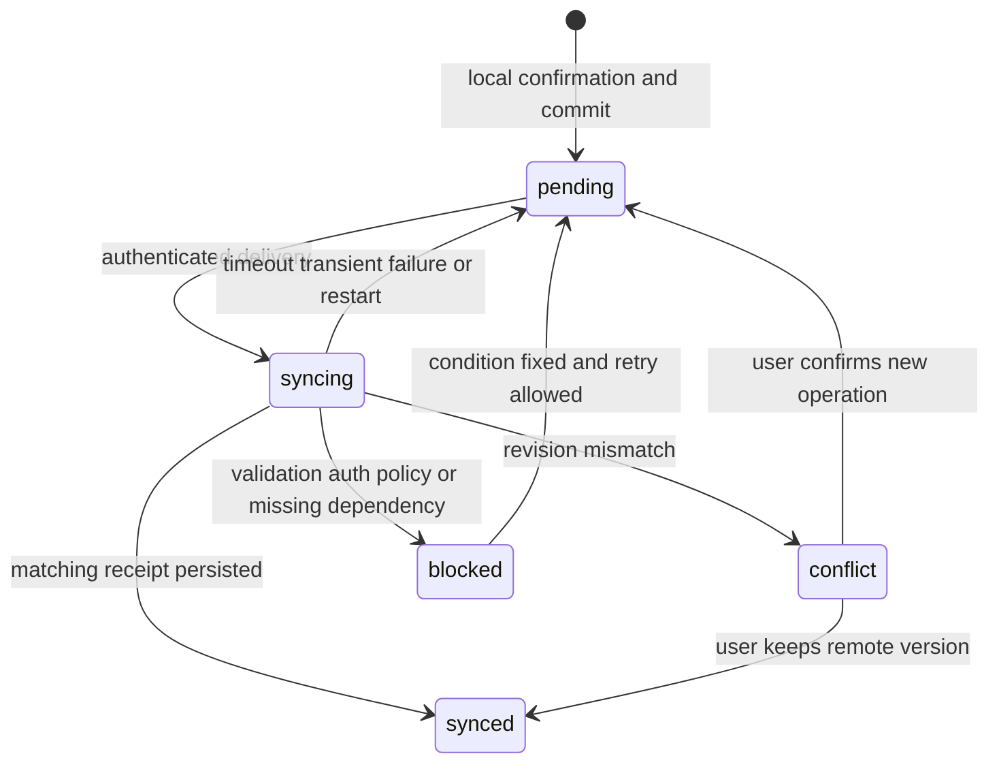
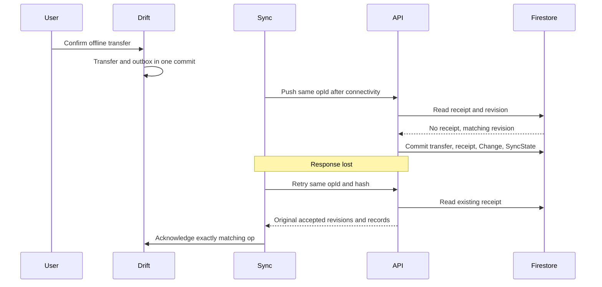

# Offline synchronization

## Source of truth and protocol

The application-facing source is Drift. Firestore holds the accepted remote replica; pending local changes form an overlay on the last accepted remote shadow. All remote writes pass through Vercel; the mobile Firestore SDK is not a second offline database. UI explicitly labels pending or conflicted totals. AI only sees synced revisions; backend responses disclose their source watermark.

Each user has a monotonically increasing server sequence and each entity a revision. Clients push immutable operations with opId and baseRevision. Firestore transactions atomically verify revision/reference constraints, replace canonical records, create an operation receipt, append one full-record Change and advance SyncState. Server commits serialize the user's changes through SyncState. This is appropriate for a personal workload; evaluate contention before public expansion.

## Local write and outbox

Inside one SQLite transaction: validate exact payload and confirmation, write local overlay, increment localVersion, enqueue immutable outbox operation. Publish Drift streams only after commit. A crash before commit has no effect; after commit the operation survives restart. Confirmation binds action, target, base/local version and payloadHash. No network calls occur inside this SQLite transaction.

Operations waiting behind another edit to the same entity retain dependsOnOpId and baseRevision=null. The server resolves the effective base revision from that predecessor's accepted receipt for the same target; it never modifies the submitted operation. Without a dependency, baseRevision is explicit (0 for create). Confirmation binds the dependency and null revision as submitted. The resolved predecessor revision must still equal the current canonical revision, so intervening remote edits conflict. Do not mutate an operation already enqueued. A second edit made while the first is syncing becomes a new op; acknowledgement may clear only the matching localVersion/opId, never the later overlay. Unconfirmed draft edits may be coalesced before receiving an opId; confirmed operations remain immutable.

Reference creates are delivered before referencing transactions; this cross-entity ordering is tracked locally and does not use the same-entity dependsOnOpId field. Server reference validation remains authoritative. Account plus opening is a single compound action. Operations with failed/conflicted dependencies are blocked until resolved. A create followed by offline delete remains two ordered operations, preserving auditability.

## State machine

“synced” describes the entity only if no newer operations remain. Per-operation terminal states are acknowledged, superseded or rejected; retain evidence in local history until export/retention policy. On startup any syncing operation returns to pending using the same opId.

## Pull, push, pull

1. On launch, resume, confirmed local write or connectivity recovery, serialize one sync cycle per UID/device. Refresh credentials as needed. Check actual HTTP success, not connectivity type alone.
2. Pull `/api/v1/sync/changes?afterSeq=C&limit=100`. First page captures watermark W from SyncState. Subsequent pages pass W; query immutable changes C < seq <= W, ascending. Each Change contains full records so concurrent writes cannot change already paged history.
3. Apply each page and next cursor atomically in Drift. Update RemoteShadow only for higher revisions. If no pending overlay, materialize canonical rows; otherwise preserve overlay and flag competing revisions. Compound mutations such as account/opening apply atomically. Do not skip a malformed/unknown-schema record or advance past it.
4. Push up to 20 ready operations, dependency order. Each is independently atomic; a batch may partially succeed. Server checks existing receipt **before** revision validation. Matching hash returns original acceptance; different hash returns IDEMPOTENCY_KEY_REUSED.
5. Persist receipts and update local shadow/overlay carefully. Pull again to include server-generated review/activity changes. Schedule another bounded cycle if more work remains.

## Deterministic conflict policy

CAS: create requires entity absent and baseRevision=0; update/delete requires exact canonical revision and nondeleted target. Tombstoned IDs cannot be recreated. An attempted edit from before a delete conflicts; an old delete against a newer edit also conflicts. There is no blanket delete-wins or timestamp-wins policy. A duplicate already accepted delete returns its receipt.

First successfully serialized server commit wins **remote acceptance**. Later conflicting edits are preserved locally and require user resolution; this is deterministic optimistic concurrency, not a promise of device-time ordering. Do not field-merge any transaction, rule, settings or reference object automatically. Reference metadata conflicts follow the same policy for simplicity.

Conflict UI shows base, local and remote with amount/account/date differences. “Keep remote” drops the local overlay and marks dependent ops for review; “Apply my changes” constructs a new operation against the current revision and requires fresh confirmation. Never retry a rejected financial payload against a new revision silently. If the target was deleted, restoring it is out of MVP; the user can explicitly create a new transaction ID after reviewing duplicate risk.

Server dependency validation uses canonical references within the same transaction. Archiving an account concurrent with a new transaction either follows the accepted transaction or causes the new write to fail with ARCHIVED_REFERENCE. An edit retaining an existing archived reference is allowed; changing to an archived reference is not. Category/source deletion is replaced by archive. Limits and budget hierarchy are validated under the per-user serialization lock.

## Deletion, idempotency and atomic transfers

Financial delete produces a full tombstone with increased revision and timestamp; queries exclude it but sync retains it indefinitely. Balance projections are always rebuilt from current records, not incremented on receipt. Therefore replaying a Change or receipt cannot double-count.

A transfer is one Transaction with two account effects, committed locally and remotely as one unit. Account creation emits two records in a single Change. Opening correction has its own revision-checked operation. Agent reviews/proposals do not edit either account effect.

## Retry and device lifecycle

Transient network/408/429/5xx: full-jitter exponential backoff starting 1 second, capped at 5 minutes; respect Retry-After up to 1 hour, then defer to next foreground cycle. Maximum 5 consecutive attempts per cycle, then show pending status. Never discard operations on timeout. 401 refresh once; revoked/403 pause network and require session resolution. 409 conflicts pause that entity; 422 is blocked pending user correction via a new operation. 413 splits the transport batch only, never a compound operation.

Android/iOS background execution is opportunistic; no exact sync SLA while suspended. Foreground resume guarantees an attempted cycle, with manual “Sync now.” Do not require a background plugin for correctness. Offline data remains available after token expiry for the same previously signed-in UID. First sign-in, reinstallation and a new device require network bootstrap.

Logout closes the UID database, cancels in-flight work and clears session material. If pending operations exist, offer stay signed in, keep a locked local copy for that UID, or explicitly discard after warning; never silently upload under another UID. Switching accounts uses a different database and cursor. Remote revocation cannot erase already downloaded offline data; disclose this boundary.

## Bootstrap and recovery

A new device starts afterSeq=0 and replays all retained Changes to W into a new database; bounded pages allow resume after interruption. Existing local outbox remains isolated during full rebuild. No timestamp cursor and no initial snapshot race. Since MVP keeps the change log, there is no cursor-expiry case; future compaction requires a versioned snapshot protocol first.

If a checksum/invariant fails, stop applying changes, retain exportable data and diagnostics, and offer an explicit rebuild of accepted shadows after backup. Reapply pending operations only through the normal conflict flow. Never treat cloud sync as a backup of unsynced data. See [testing](10-TESTING-STRATEGY.md) for crash-boundary and two-device scenarios.
