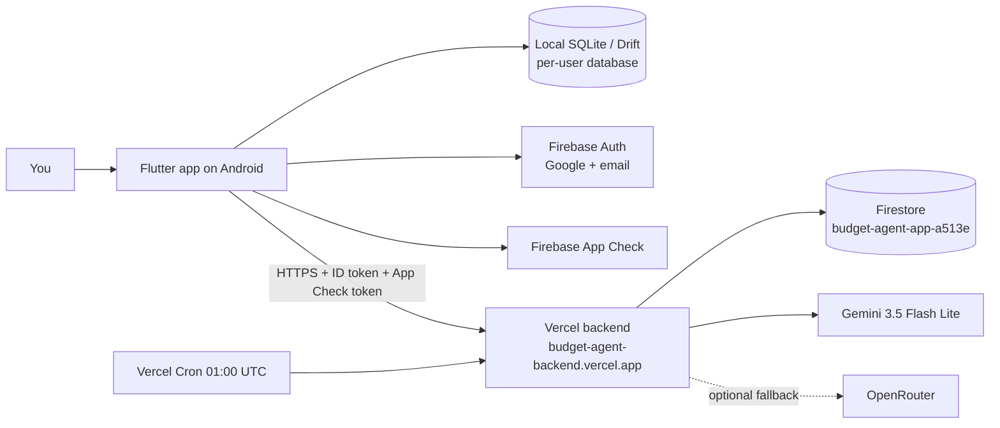
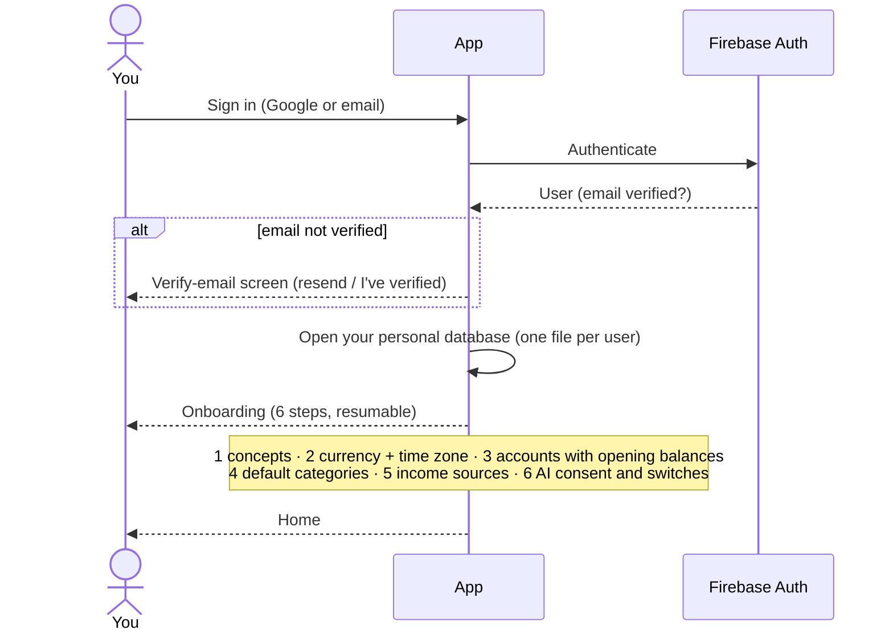
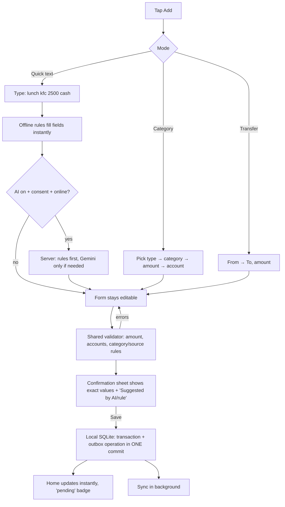
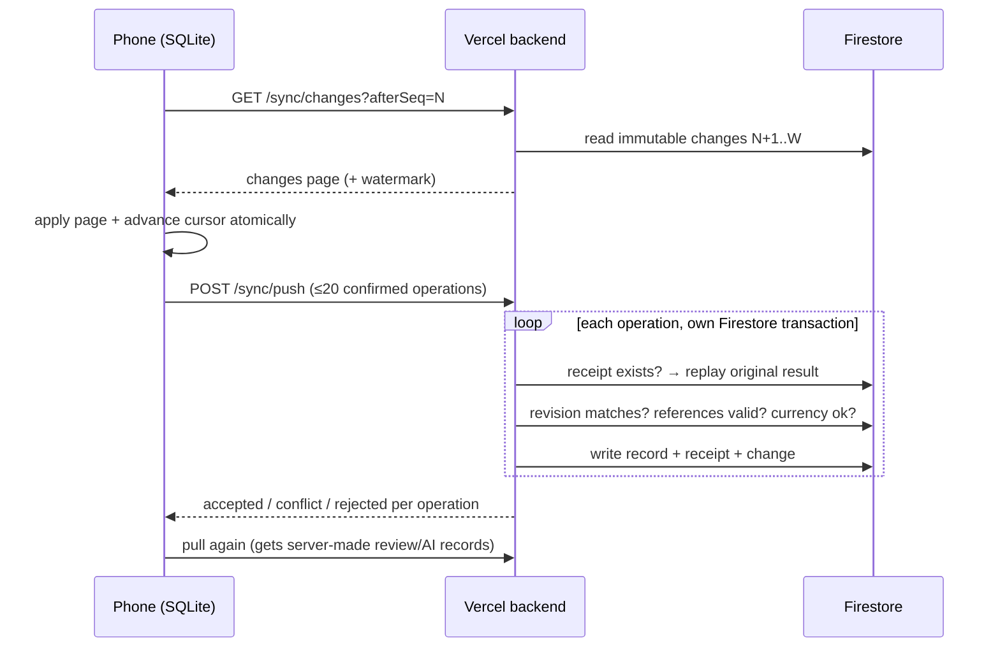
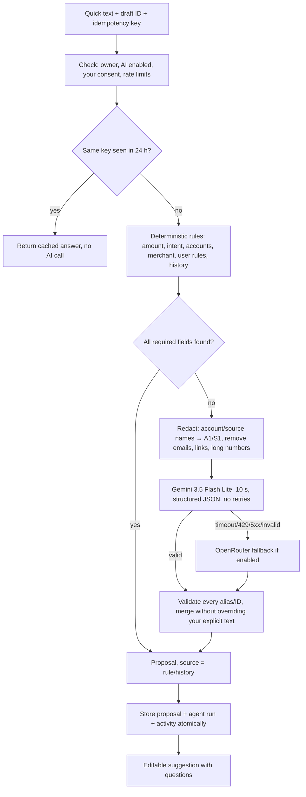

# Budget Agent — System Documentation (as implemented)

Status: implemented and running, 2026-10-02. This document describes how the **built** system works. The numbered specifications (`docs/00`–`14`) describe the target design; where the implementation refines them, see ADR-16 in [13-DECISIONS](13-DECISIONS.md). The module-level reference is [TECHNICAL-DOCUMENTATION](TECHNICAL-DOCUMENTATION.md).

---

## 1. What the system is

Budget Agent — shipped to users as **Surge Budget** ("Your AI money agent") — is a personal finance app for one owner. You record income, expenses and transfers in seconds — by typing a sentence (`lunch kfc 2500 cash`) or by picking a category — and the app keeps an exact ledger of every account. AI helps fill in details, but **nothing is ever saved without you confirming the exact values**.

Three principles shape everything:

1. **The phone is the source of truth for you.** Every save goes to a local SQLite database first. The app works completely offline after the first sign-in.
2. **Money is exact.** Amounts are integers in minor units (LKR 2,500.00 is stored as `250000`). Balances are never stored — they are always calculated from the confirmed transactions.
3. **AI proposes, you decide.** AI and rules only suggest. Every create/edit/delete goes through a confirmation sheet showing the exact payload.

## 2. The parts

| Part | Where | Responsibility |
|---|---|---|
| Mobile app | `mobile/` (Flutter, Android) | All screens, local ledger, offline rules, sync engine, confirmations |
| Local database | SQLite on the phone (Drift) | Confirmed transactions, pending changes (outbox), last accepted server copies, sync cursor |
| Backend | `backend/` on Vercel (TypeScript) | Authenticated sync gateway, AI agent services, daily review job |
| Cloud database | Firestore (Spark plan) | Accepted replica of the ledger, immutable change log, receipts, AI outputs |
| Identity | Firebase Auth | Google and email/password sign-in; email must be verified |
| Attestation | Firebase App Check | Proves requests come from the genuine app |
| AI | Gemini (primary), OpenRouter (optional fallback) | Structured suggestions only; never touches the database |

**Important boundary:** the phone never talks to Firestore directly. Firestore security rules deny all client access; only the backend (with a service account) reads and writes, after checking identity, ownership and data validity.

## 3. Core concepts

| Concept | Meaning | Example |
|---|---|---|
| Account | Where money is | Cash Wallet, BOC, Commercial Bank |
| Income source | Where income came from (holds no money) | Acme Employer, Freelance client |
| Category | What money was for (two levels max) | Food → Restaurant |
| Expense | Money leaves one account | Lunch 2,500 from Cash |
| Income | Money arrives in one account, needs a category **and** a source | Salary 250,000 to BOC from Acme |
| Transfer | Money moves between two of your accounts; not spending or income | ATM withdrawal BOC → Cash |
| Opening balance | The starting amount of an account; a special transaction created with the account | Cash opened with 5,000 |
| Budget | Monthly limit for an expense category (parent includes children) | Food: 30,000 in 2026-10 |

Balance of an account = opening ± every confirmed transaction that touches it. Transfers move money between accounts so total wealth is unchanged; reports (income/spending) exclude transfers and openings.

## 4. How the main flows work

### 4.1 First run: sign in and onboarding

Every onboarding save goes through the confirmation sheet and is written locally first; sync happens later automatically.

### 4.2 Recording a transaction (both entry paths)

- Fields you edit are never overwritten by a late AI answer; the AI's other ideas appear as an "Apply suggestion" card.
- Saving twice (double tap) produces one operation — the sheet locks while saving and each entry has a stable ID.
- After saving you can **Undo** (a confirmed delete) and, if learning is on, **Remember merchant → category** as a rule for next time.

### 4.3 Sync (pull → push → pull)

Sync is triggered on app start, resume, network return, after each local save (2 s debounce), every 5 minutes in the foreground, and by **Sync now**.

Guarantees:
- **No double counting:** each operation has a permanent ID and receipt; retrying after a lost response replays the original result.
- **No silent overwrites:** every edit carries the revision it was based on. If another device changed the record first, you get a **conflict** showing "Saved on this device" vs "Accepted from another device" and choose *Keep remote* or *Review and apply mine*.
- **Rejected changes** (e.g. referencing an archived account) are kept as *blocked* with an explanation and a *Discard my change* option.
- **Nothing is lost offline:** the outbox survives restarts; network failures back off (1 s → 5 min) and retry.

### 4.4 AI parsing on the server

The model never sees account names or your full ledger, and it cannot save anything. Its output is checked against your real accounts/categories; invented IDs are rejected. A daily budget (100 attempts, 100k input / 20k output tokens) caps usage.

### 4.5 Daily review (runs at 01:00 UTC ≈ 06:30 Sri Lanka)

1. Vercel Cron calls `/api/jobs/daily-agent` with the secret; only your configured account is processed.
2. A 90-second fenced lease prevents two runs working at once.
3. Up to 50 new/edited transactions are reviewed: consistency checks for all, category suggestions for uncategorized expenses (rules first, Gemini if allowed), at most 20 AI attempts and 45 s of work.
4. Results appear in the app as **Review suggestions** (accept through the normal confirmation, or reject) and in **AI Activity**.
5. Insights are computed from the ledger (never by the AI): month-to-date summary, last month vs the month before, and possible recurring expenses.
6. Old AI records are cleaned up (activity 90 days, finished proposals 30 days).

The job never changes a confirmed transaction or balance.

## 5. Screens

On launch a native launch screen shows the Surge Budget mark, then a ~3.6 s animated intro: the coin pops in, a light sweep surges up the arrow, the robot mascot lands on the arrowhead, waves and says "Hi!", and the wordmark rises in (skipped when the system "remove animations" setting is on). Home's balance counts up and its cards slide in.

| Area | What you can do |
|---|---|
| Home | Recorded balance (all accounts), account balances, this month's income/spending, budgets, review card, an insight, recent entries, last synced |
| Add (FAB) | Quick text with AI, category entry (small button), transfers |
| Transactions | Filter by type/account/category/month/sync state; open details; edit, delete, suggest category, accept/reject suggestions |
| Insights | Deterministic insights with coverage and "stale" labels; dismiss |
| More → Accounts | Balances, create with opening balance, rename/archive, correct opening balance (before/after preview) |
| More → Categories / Income sources / Rules | Manage the category tree, sources and learned rules |
| More → Budgets | Monthly limits with spent / remaining |
| More → AI Activity | Timeline of what the AI proposed, applied, skipped or failed |
| More → Sync & conflicts | Pending count, last synced, conflicts, blocked changes, Sync now |
| More → Settings | Theme, time zone, default account, AI / fallback / daily review / learning switches, sign out |

## 6. Security and privacy in practice

- Every API call carries a Firebase ID token **and** an App Check token. The backend checks them in order, then requires the token's UID to equal `OWNER_UID` and the email to be verified. Nobody else can use the backend.
- The phone has no AI keys or service-account credentials. Secrets exist only in Vercel environment variables.
- Firestore is closed to all clients; the backend scopes every path to the verified user.
- AI sees only redacted text plus neutral aliases (A1, C2, S1). Prompts and raw inputs are never logged.
- Local databases are excluded from Android cloud backup and device transfer.
- Release builds are signed with the private upload key (kept outside git).

Current temporary exception: the release build installed over USB uses the App Check **debug** provider (`ALLOW_DEBUG_APP_CHECK_IN_RELEASE=true`) because Play Integrity only works for apps installed from Google Play. Remove it and delete the registered debug token before a public release.

## 7. Deployed environment (production)

| Item | Value |
|---|---|
| Backend | https://budget-agent-backend.vercel.app (Vercel team `dilax`, project `budget-agent-backend`, Node 22) |
| Firebase project | `budget-agent-app-a513e` (Firestore, Auth, App Check) |
| Android app | `com.dilaxdigit.budget_agent`, signed release APK |
| AI model | `gemini-3.5-flash-lite` (AI_ENABLED=true, fallback off) |
| Daily job | `0 1 * * *` UTC |
| Code graph | `graphify-out/` (Graphify; open `graph.html`, read `GRAPH_REPORT.md`) |

## 8. What is not built yet

- Export / restore of the local database (Settings shows "Not available yet").
- CI pipeline with secret scanning and Firestore emulator tests.
- Google Play release with real Play Integrity (currently debug App Check over USB).
- Live measurement of AI parsing accuracy on real data.

## 9. Everyday operations

| Task | How |
|---|---|
| Force a sync | App → More → Sync & conflicts → Sync now |
| Turn AI off quickly | Vercel env `AI_ENABLED=false` → redeploy (manual entry keeps working) |
| Run the daily review now | `curl -H "Authorization: Bearer <CRON_SECRET>" https://budget-agent-backend.vercel.app/api/jobs/daily-agent` |
| Check backend health | `https://budget-agent-backend.vercel.app/api/health` |
| Rotate a leaked secret | Change it in Vercel (or Firebase/Google), redeploy |
| Install a new app build | `flutter build apk --release --dart-define-from-file=env/prod.json` then `adb install -r build/app/outputs/flutter-apk/app-release.apk` |

Setup from scratch is in [MANUAL_STEPS.md](../MANUAL_STEPS.md).
